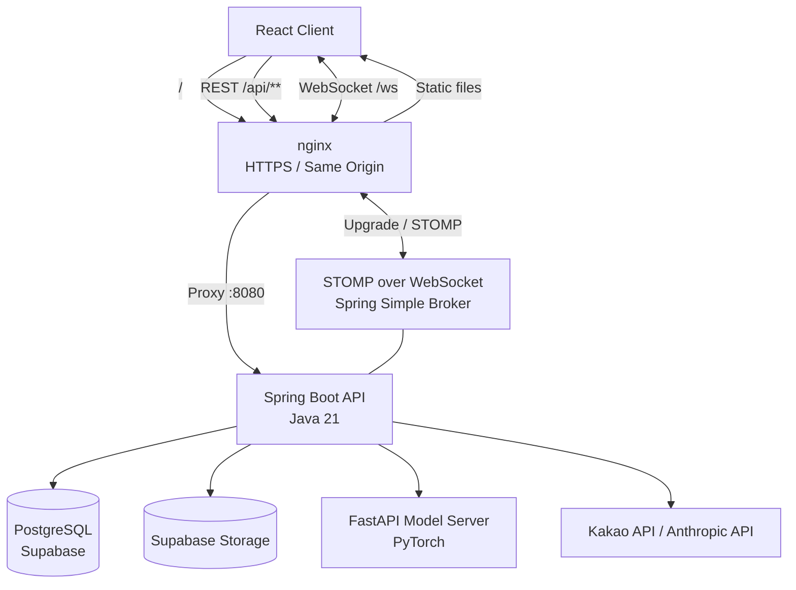
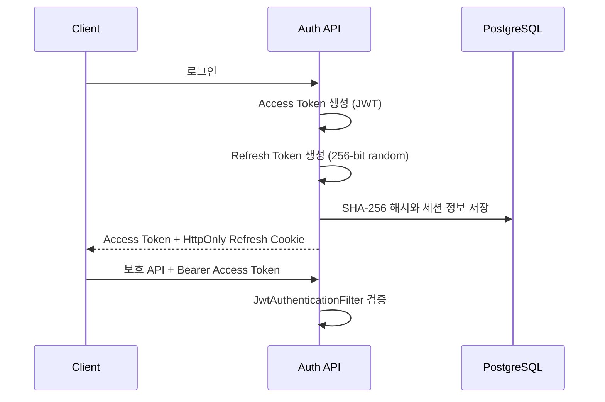
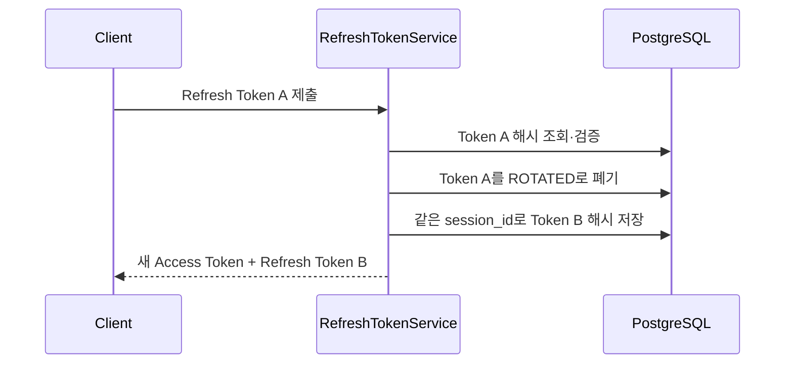
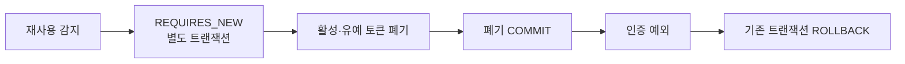
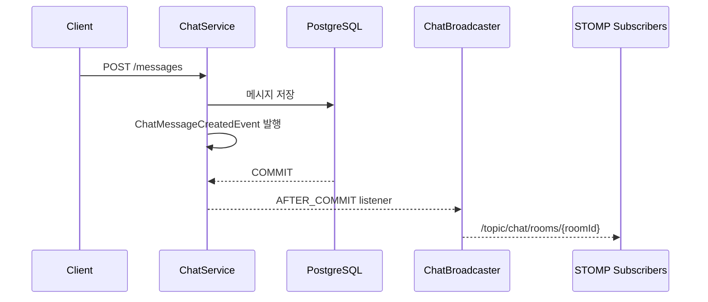
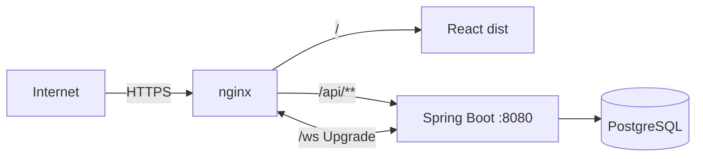

# 댕댕댕

> 반려동물 관리, 숏폼 콘텐츠, 실시간 오픈채팅, 산책 정보와 AI 진단 기능을 하나의 모바일 환경에서 제공하는 반려동물 통합 케어 플랫폼

**Java 21 · Spring Boot 3.5 · Spring Security · Spring Data JPA · PostgreSQL · WebSocket/STOMP**

4인 팀 프로젝트에서 **회원·인증, 반려동물, 실시간 오픈채팅, 배포 환경**을 담당했습니다.

### 핵심 구현

- JWT Access Token과 opaque Refresh Token을 분리하고, Refresh Token Rotation 및 재사용 감지를 구현했습니다.
- 재사용 감지 후 토큰 폐기가 예외와 함께 롤백되는 문제를 별도 Bean의 `REQUIRES_NEW` 트랜잭션으로 해결했습니다.
- 채팅은 **REST 송신 + STOMP 수신**으로 역할을 분리하고, STOMP `CONNECT`와 `SUBSCRIBE` 단계에서 인증·인가합니다.
- `AFTER_COMMIT` 이벤트를 사용해 DB에 확정된 채팅 메시지만 WebSocket으로 전달합니다.
- 반려동물 수정·삭제 충돌은 JPA `@Version`을 이용한 낙관적 잠금으로 감지합니다.
- AWS EC2, nginx, systemd, GitHub Actions로 배포 흐름을 구성하고, 헬스체크 실패 시 직전 백엔드 JAR를 복구합니다.

> 배포 이력: 2026년 8~9월 AWS EC2에서 배포·운영했으며, 현재 서버는 중단된 상태입니다.  


---

## 목차

1. [프로젝트 소개](#프로젝트-소개)
2. [담당 역할](#담당-역할)
3. [기술 스택](#기술-스택)
4. [시스템 아키텍처](#시스템-아키텍처)
5. [주요 기능](#주요-기능)
6. [핵심 설계와 문제 해결](#핵심-설계와-문제-해결)
7. [배포와 CI](#배포와-ci)
8. [프로젝트 구조](#프로젝트-구조)
9. [한계와 개선 계획](#한계와-개선-계획)

---

## 프로젝트 소개

댕댕댕은 반려동물 보호자가 반려동물 프로필 관리, 숏폼 콘텐츠, 실시간 오픈채팅, 산책 기록, 장소 검색과 AI 기반 건강 진단 기능을 한 서비스에서 이용할 수 있도록 만든 모바일 퍼스트 웹 애플리케이션입니다.

| 항목 | 내용 |
| --- | --- |
| 개발 기간 | 2026.08.04 ~ 2026.09.01 |
| 개발 인원 | 4명 |
| 담당 영역 | Backend / Infra |
| 저장소 구성 | Spring Boot 백엔드, React 프론트엔드, FastAPI 모델 서버 |
| 배포 환경 | AWS EC2, nginx, systemd, GitHub Actions |

---

## 담당 역할

### Backend

- 회원가입, 로그인, 카카오 OAuth, 회원 정보와 기기별 세션 관리
- Spring Security와 JWT 기반 인증 필터
- Refresh Token 발급·회전·재사용 감지·폐기
- 반려동물 등록·조회·수정·삭제, 노출 순서와 프로필 이미지 관리
- 오픈채팅방, 참여자와 역할, 메시지, 읽음 위치, 공지 핀 관리
- STOMP 연결 인증, 채팅방 구독 인가와 세션 정리
- 공통 API 응답, 오류 코드와 전역 예외 처리 규약

### Infra / Collaboration

- AWS EC2의 nginx·systemd 실행 환경 구성
- GitHub Actions 기반 백엔드·프론트엔드 빌드와 배포 자동화
- WebSocket reverse proxy와 동일 Origin 배포 구성
- 저장소 통합, 코드 병합

---

## 기술 스택

| 구분 | 기술 |
| --- | --- |
| Backend | Java 21, Spring Boot 3.5.16, Spring Security, Spring Data JPA, Gradle |
| Authentication | JWT (JJWT), BCrypt, opaque Refresh Token |
| Database | PostgreSQL, Supabase |
| Realtime | WebSocket, STOMP, Spring Simple Broker |
| Frontend | React 19, Vite, React Router, `@stomp/stompjs` |
| AI Server | Python, FastAPI, PyTorch |
| External / Storage | Kakao API, Anthropic Java SDK, Supabase Storage |
| Infra / CI·CD | AWS EC2, nginx, systemd, GitHub Actions |

---

## 시스템 아키텍처



nginx가 정적 프론트엔드, REST API, WebSocket을 하나의 Origin으로 제공합니다.

```text
/        → React 정적 파일
/api/**  → Spring Boot :8080
/ws      → WebSocket :8080
```

이 구조에서 Refresh Token 쿠키의 `SameSite=Strict` 정책을 유지하고, 프론트엔드와 API를 다른 Origin으로 분리할 때 생기는 CORS·쿠키 관리 복잡도를 줄였습니다.

---

## 주요 기능

### 회원·인증

- 이메일 회원가입·로그인과 BCrypt 비밀번호 해싱
- JWT Access Token 인증
- Refresh Token Rotation, 재사용 감지와 기기별 세션 관리
- 단일 기기 로그아웃, 원격 로그아웃, 비밀번호 변경 시 세션 폐기
- 카카오 OAuth 로그인과 회원 탈퇴

### 반려동물

- 반려동물 등록·조회·수정·소프트 삭제
- 사용자별 소유 데이터 격리
- 노출 순서 변경과 프로필 이미지 업로드
- 낙관적 잠금을 통한 동시 수정·삭제 충돌 감지

### 오픈채팅

- 채팅방 생성·조회·입장·퇴장·삭제
- `OWNER`·`MANAGER`·`MEMBER` 역할과 강퇴·위임
- 텍스트·이미지 메시지, 읽음 위치와 공지 메시지 핀
- REST 메시지 저장과 STOMP 실시간 수신
- 강퇴·퇴장·탈퇴 후 기존 WebSocket 세션 정리

### 서비스 기능 (팀원 담당)

- 반려동물 숏폼 피드와 상호작용
- 산책 기록과 반려동물 동반 장소 검색
- FastAPI 모델 서버를 연동한 피부·건강 진단
- Anthropic API를 이용한 AI 기능

---

## 핵심 설계와 문제 해결

### 1. Access Token과 Refresh Token의 역할 분리

Access Token은 서명된 JWT로 만들고 `Authorization: Bearer` 헤더로 전달합니다. 클레임에는 회원 ID, 역할, 발급·만료 시각만 넣어 이름이나 이메일 같은 개인정보를 포함하지 않았습니다.

Refresh Token은 JWT가 아닌 256-bit 난수 기반의 opaque token입니다. 원문은 쿠키로 한 번 전달한 뒤 서버에 남기지 않고, DB에는 SHA-256 해시만 저장합니다. 따라서 DB가 세션 상태의 기준이 되며 특정 토큰이나 기기 세션을 즉시 폐기할 수 있습니다.



보호 API는 `OncePerRequestFilter` 기반 필터에서 Access Token을 검증하고, 회원 ID와 역할을 `SecurityContext`에 등록합니다. 만료·위조 토큰은 각각 401 응답으로 처리합니다.

관련 코드:

- [`JwtTokenProvider`](./pet_backend/src/main/java/com/pet/backend/security/JwtTokenProvider.java)
- [`JwtAuthenticationFilter`](./pet_backend/src/main/java/com/pet/backend/security/JwtAuthenticationFilter.java)
- [`SecurityConfig`](./pet_backend/src/main/java/com/pet/backend/security/SecurityConfig.java)

### 2. Refresh Token Rotation과 재사용 감지

Refresh Token 재발급 시 기존 토큰을 `ROTATED` 상태로 폐기하고 같은 기기 세션 ID를 이어받은 새 토큰을 발급합니다. 응답 유실이나 여러 탭의 동시 갱신을 실제 공격으로 오인하지 않도록 회전된 토큰에는 30초의 유예 시간을 둡니다.



유예 시간을 지난 폐기 토큰이 다시 제출되면 정상 흐름에서 복사본이 재사용된 것으로 보고, 해당 회원의 활성 Refresh Token과 유예 중 토큰을 함께 무효화합니다.

관련 코드: [`RefreshTokenService`](./pet_backend/src/main/java/com/pet/backend/member/RefreshTokenService.java)

### 3. 토큰 폐기가 예외와 함께 롤백되는 문제

#### 문제

재사용된 Refresh Token을 감지하면 모든 토큰을 폐기한 뒤 인증 예외를 던져야 합니다. 이를 같은 트랜잭션에서 처리하면 예외 때문에 트랜잭션 전체가 롤백되어, 보안상 반드시 남아야 하는 폐기 결과까지 취소됩니다.

```text
재사용 감지 → 전체 토큰 폐기 → 인증 예외 → Transaction Rollback
                                         └→ 폐기 결과도 취소
```

#### 해결

폐기 로직을 별도 Spring Bean으로 분리하고 `Propagation.REQUIRES_NEW`를 적용했습니다. 내부 메서드 호출에서는 프록시를 거치지 않아 트랜잭션 전파 설정이 적용되지 않으므로, 클래스 자체를 분리했습니다.



요청 자체가 실패하더라도 새 트랜잭션에서 커밋된 폐기 결과는 유지됩니다.

관련 코드: [`RefreshTokenReuseHandler`](./pet_backend/src/main/java/com/pet/backend/member/RefreshTokenReuseHandler.java)

### 4. REST 송신 + STOMP 수신 구조

메시지 생성은 기존 HTTP 인증·검증·예외 처리 흐름을 활용할 수 있도록 REST API로 제한하고, WebSocket은 서버 이벤트의 실시간 수신에만 사용합니다.

```text
메시지 송신: Client → REST API → 권한 검증 → DB 저장
메시지 수신: DB Commit → Domain Event → STOMP Topic → Subscribers
```

WebSocket HTTP 핸드셰이크는 브라우저가 임의의 Authorization 헤더를 붙이기 어려워 공개하고, 다음 STOMP 프레임에서 권한을 검증합니다.

- `CONNECT`: Access Token 검증 후 회원 ID를 WebSocket 세션의 `Principal`로 등록
- `SUBSCRIBE`: `/topic/chat/rooms/{roomId}` 형식을 확인하고 활성 방의 실제 참여자인지 조회
- `SEND`: 클라이언트가 Broker로 직접 메시지를 발행하지 못하도록 거부
- `UNSUBSCRIBE`·`DISCONNECT`: 세션 정리를 위해 허용

관련 코드:

- [`ChatStompInterceptor`](./pet_backend/src/main/java/com/pet/backend/chat/websocket/ChatStompInterceptor.java)
- [`ChatController`](./pet_backend/src/main/java/com/pet/backend/chat/ChatController.java)

### 5. DB Commit과 WebSocket 방송의 순서 보장

#### 문제

메시지를 저장한 직후 같은 트랜잭션 안에서 WebSocket으로 전송하면, 클라이언트가 메시지를 받은 뒤 DB 트랜잭션이 롤백될 수 있습니다. 이 경우 화면에는 보였지만 DB에는 존재하지 않는 메시지가 생깁니다.

#### 해결

채팅 서비스는 메시지 저장 후 도메인 이벤트만 발행합니다. `ChatBroadcaster`가 `@TransactionalEventListener(phase = AFTER_COMMIT)`으로 이벤트를 받아, DB 커밋이 성공한 뒤에만 STOMP 토픽으로 전달합니다.



방송 실패가 이미 완료된 DB 커밋을 되돌릴 수 없으므로, Broadcaster 내부에서 실패를 기록하고 클라이언트의 재조회·재연결 경로로 복구하도록 했습니다.

관련 코드: [`ChatBroadcaster`](./pet_backend/src/main/java/com/pet/backend/chat/websocket/ChatBroadcaster.java)

### 6. 반려동물 동시 수정·삭제와 낙관적 잠금

같은 반려동물 행을 수정하는 요청과 삭제하는 요청이 동시에 처리되면, 늦게 커밋된 수정이 앞선 삭제의 `deleted_at` 값을 덮어써 삭제한 데이터가 다시 활성 상태로 보일 수 있었습니다.

`Pet` 엔티티에 `@Version`을 적용해 읽은 버전과 저장 시점의 버전이 다르면 충돌로 처리합니다. 먼저 커밋한 요청만 성공하고 늦은 요청은 예외가 발생해 409 응답으로 변환됩니다.

```text
수정 요청: version 3 ── COMMIT → version 4
삭제 요청: version 3 ── COMMIT 시도 → version 불일치 → 409
```

관련 코드: [`Pet`](./pet_backend/src/main/java/com/pet/backend/pet/Pet.java)

### 7. 소유자 데이터 격리

반려동물을 ID로 먼저 조회한 뒤 서비스 계층에서 소유자를 비교하지 않고, Repository 조회 조건에 `petId + memberId + deletedAt is null`을 함께 넣었습니다.

```text
JWT에서 확인한 memberId
          ↓
findByIdAndMemberIdAndDeletedAtIsNull(petId, memberId)
          ↓
내 활성 데이터만 반환 / 그 외는 동일하게 404
```

타인의 반려동물 ID를 알고 있어도 조회·수정·삭제할 수 없으며, 타인 소유 데이터와 존재하지 않는 데이터는 같은 404로 처리해 리소스 존재 여부도 노출하지 않습니다.

관련 코드:

- [`PetRepository`](./pet_backend/src/main/java/com/pet/backend/pet/PetRepository.java)
- [`PetService`](./pet_backend/src/main/java/com/pet/backend/pet/PetService.java)

### 8. 외부 I/O와 DB 트랜잭션 분리

Supabase Storage 이미지 업로드는 네트워크 지연이 발생할 수 있으므로 DB 트랜잭션 밖에서 실행합니다. 업로드 전 소유권을 확인하고, 업로드가 끝난 뒤 별도 컴포넌트에서 이미지 URL만 짧은 트랜잭션으로 저장합니다.

```text
파일 검증 → 소유자 확인 → Storage 업로드 → 짧은 DB 트랜잭션으로 URL 저장
```

외부 응답을 기다리는 동안 DB Connection을 점유하지 않고, 저장 단계에서 반려동물 상태를 다시 조회해 검증과 저장 사이의 삭제도 확인합니다.

관련 코드:

- [`PetService`](./pet_backend/src/main/java/com/pet/backend/pet/PetService.java)
- [`PetProfileImageUpdater`](./pet_backend/src/main/java/com/pet/backend/pet/PetProfileImageUpdater.java)

---

## 배포와 CI

### AWS EC2 배포 구조



- nginx에서 HTTP를 HTTPS로 리다이렉트하고 SPA fallback을 처리합니다.
- `/api/`는 Spring Boot로 reverse proxy합니다.
- `/ws`에는 `Upgrade`·`Connection` 헤더와 WebSocket timeout을 별도로 설정합니다.
- Spring Boot 애플리케이션은 systemd 서비스로 관리합니다.

관련 설정:

- [`nginx-pet.conf`](./deploy/nginx-pet.conf)
- [`pet-backend.service`](./deploy/pet-backend.service)

### GitHub Actions

```text
dev / sub push, PR
  → Backend bootJar 빌드
  → Frontend npm build

main push 또는 수동 실행
  → Backend·Frontend 빌드
  → EC2로 산출물 전송
  → 정적 파일과 JAR 교체
  → systemd 재시작
  → HTTP 헬스체크
  → 실패 시 직전 Backend JAR 복구
```


## 프로젝트 구조

```text
pet_project/
├── .github/
│   └── workflows/
│       ├── ci.yml                 # dev·sub 빌드 검증
│       └── deploy.yml             # main 기준 EC2 배포
├── deploy/
│   ├── nginx-pet.conf             # HTTPS·REST·WebSocket reverse proxy
│   ├── pet-backend.service        # Spring Boot systemd 서비스
│   └── setup-server.sh            # 서버 초기 설정
├── pet_backend/
│   └── src/main/java/com/pet/backend/
│       ├── member/                # 회원·Refresh Token·세션
│       ├── security/              # Spring Security·JWT 필터
│       ├── pet/                   # 반려동물·소유자 격리·낙관적 잠금
│       ├── chat/                  # 채팅방·참여자·메시지·권한
│       │   └── websocket/         # STOMP 인증·인가·방송
│       ├── common/                # 공통 응답·예외·Storage 연동
│       ├── shorts/                # 숏폼 콘텐츠
│       ├── walk/                  # 산책 기록
│       ├── place/                 # 장소 검색
│       ├── skin/                  # 피부 진단 연동
│       ├── hybrid/                # 건강 진단 연동
│       └── aisearch/              # AI 검색·대화 기능
├── pet_frontend/                  # React·Vite 클라이언트
└── pet_model/                     # FastAPI·PyTorch 추론 서버
```

---

## 한계와 개선 계획

### 1. 자동화 테스트가 CI에 포함되지 않음

현재 CI는 `bootJar -x test`로 빌드만 검증합니다. 인증·회전·트랜잭션·동시성처럼 회귀 위험이 큰 규칙을 자동화된 테스트로 고정할 필요가 있습니다.

개선 방향:

- JWT와 Refresh Token 규칙은 외부 의존성이 없는 단위 테스트로 분리
- Testcontainers PostgreSQL을 이용해 Rotation, 재사용 감지와 `REQUIRES_NEW` 시나리오 통합 테스트
- 두 요청을 병렬 실행해 낙관적 잠금 충돌과 409 응답 검증
- CI용 설정과 Secret을 분리해 Pull Request 단계에서 테스트 실행

### 2. 헬스체크 범위가 애플리케이션 기동 확인에 한정됨

현재 배포 워크플로는 로그인 API가 빈 요청에 400을 반환하는지 확인해 웹·Security·JSON 처리 스택의 기동 여부를 판단합니다. DB 연결과 주요 외부 의존성까지 확인하지는 않습니다.

개선 방향:

- Spring Boot Actuator의 readiness·liveness probe 도입
- DB 연결을 포함한 readiness와 프로세스 생존만 확인하는 liveness 분리
- 프론트엔드 정적 파일까지 포함한 배포 검증과 복구 절차 보강

### 3. WebSocket이 단일 애플리케이션 인스턴스를 전제로 함

현재 Spring Simple Broker와 인메모리 WebSocket 세션 장부를 사용하므로 애플리케이션을 여러 인스턴스로 확장하면 세션과 메시지 전달이 인스턴스별로 나뉩니다.

개선 방향:

- Redis Pub/Sub 또는 외부 메시지 브로커를 통한 인스턴스 간 이벤트 전달
- 세션 라우팅 또는 공유 가능한 세션 상태 설계
- 재연결 폭주를 막기 위한 backoff와 관측 지표 추가

### 4. `AFTER_COMMIT` 이후 전송 실패의 내구성

`AFTER_COMMIT`은 롤백된 메시지의 방송을 막지만, DB 커밋 후 프로세스가 종료되면 이벤트 전송은 유실될 수 있습니다. 현재는 재조회·재연결 시 누락 메시지를 복구하는 방식입니다.

개선 방향:

- Outbox Pattern으로 DB 변경과 발행 대상을 같은 트랜잭션에 기록
- 재시도 가능한 비동기 발행과 실패 모니터링
- 메시지 ID 기반의 멱등 소비와 전달 지표 수집

### 5. 배포 토폴로지 변경 시 CSRF 방어 재검토 필요

현재 Refresh Token 쿠키는 동일 사이트 배포와 `SameSite=Strict`에 의존합니다. 프론트엔드와 API를 서로 다른 사이트로 분리해 `SameSite=None`이 필요해지면 현재 전제가 깨집니다.

개선 방향:

- Refresh·Logout 요청의 Origin 검증
- CSRF Token 등 별도 방어 수단 적용
- 허용 Origin과 쿠키 정책을 배포 환경별 보안 테스트로 고정

---

## 프로젝트를 통해 배운 점

이 프로젝트에서는 API 기능의 수보다 **데이터가 언제 확정되고, 실패했을 때 무엇이 반드시 남아야 하는지**를 중심으로 설계했습니다.

Refresh Token 폐기에는 트랜잭션 전파를, 채팅 방송에는 커밋 시점을, 반려동물 수정에는 버전 충돌을 적용하면서 인증·실시간 통신·동시성 문제를 Spring의 실제 실행 경계와 연결해 이해할 수 있었습니다. 또한 동일 Origin 배포, 외부 I/O 분리와 실패 시 백엔드 JAR 복구를 구성하며 애플리케이션 코드와 운영 환경을 함께 다루었습니다.
